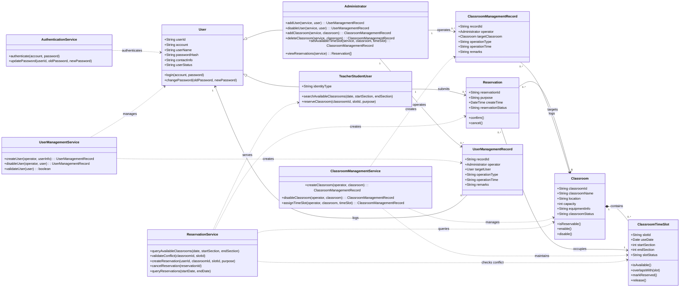

# 实验2：教室预订系统类图设计说明

## 1. 文档目的

本文件依据实验1中已经完善的需求分析，对“教室预订系统”进行实验2的类图设计说明。

本次类图设计的目标不是简单把功能名称堆成几个框，而是要把系统中的**核心业务对象、职责分配、类之间关系以及设计原则**表达清楚，使其能够直接支撑后续的数据库设计和界面设计。

## 2. 设计依据

本次类图设计主要依据以下内容：

### 2.1 来自实验1的需求依据

- 系统参与者包括管理员、师生用户。
- 核心功能包括登录、修改密码、浏览空闲教室、预订教室、用户管理、教室管理、可用时间段设置、预订情况查询。
- 时间粒度必须精确到“课时”。
- 删除用户、删除教室时需要处理关联预订记录。
- 系统需要保证教室状态、时间段状态、预订记录状态一致。

### 2.2 类图设计参考原则

结合通用的 UML 类图设计规则和面向对象设计原则，本次设计重点遵循以下原则：

- **单一职责原则**：每个类只负责一类核心职责，避免一个类既保存数据又承担过多流程控制。
- **高内聚、低耦合**：把紧密相关的数据和行为放在同一个类中，减少不必要的跨类依赖。
- **抽象合理**：将管理员、师生用户抽象到共同父类 `User`，复用公共属性与行为。
- **继承关系慎用**：只有在存在明确的“is-a”关系时才使用继承，因此 `Administrator` 和 `TeacherStudentUser` 继承自 `User`。
- **组合/聚合优先表达整体-部分关系**：教室与教室可用时间段之间是强拥有关系，因此使用组合更合理。
- **多重性明确**：类之间尽量标明 `1`、`0..*` 等多重性，体现真实业务约束。
- **命名与需求一致**：类名、操作名尽量与实验1中的角色、用例、业务规则保持一致。
- **优先围绕稳定业务概念建模**：优先保留“用户、教室、时间段、预订记录”等稳定领域对象，而不是把每个按钮或页面都画成类。

### 2.3 参考的在线资料方向

为了保证类图设计更规范，本次设计额外参考了通用 UML 类图资料中常见的建议方向，包括：

- `Agile Modeling` 关于类图关系、多重性和关系表达清晰性的建议
- `Creately`、`Visual Paradigm` 等 UML 教程中关于继承、关联、组合、多重性使用方式的说明
- 面向对象设计中常见的高内聚、低耦合、单一职责等原则

这些资料的共识是：**类图要体现稳定结构，不要把流程逻辑全部硬塞进实体类；继承只用于真正的父子概念；组合、关联和依赖要区分清楚；多重性尽量明确。**

## 3. 总体设计策略

本次类图采用“**核心实体类 + 控制/服务类**”的设计方式。

### 3.1 为什么不只画实体类

如果只画实体类，虽然图会更简单，但很多需求中的职责边界会不够清楚。例如：

- 登录验证不适合完全放在 `User` 类里
- 用户管理、教室管理、预订管理都属于系统流程控制逻辑
- 删除用户、删除教室时需要处理关联预订，这类操作更适合放在控制/服务类中

因此，将类划分为实体类和控制/服务类，会更符合单一职责原则。

### 3.2 本次保留的核心实体类

- `User`（用户抽象类）
- `Administrator`（管理员，继承自 `User`）
- `TeacherStudentUser`（师生普通用户，继承自 `User`）
- `Classroom`（教室资源）
- `ClassroomTimeSlot`（教室可用时间段）
- `Reservation`（预订记录）
- `ClassroomManagementRecord`（教室管理记录，用于将管理员与教室的 N:M 管理关系拆解为 1:N）
- `UserManagementRecord`（用户账号管理记录，用于将管理员与普通用户的 N:M 管理关系拆解为 1:N）

### 3.3 本次保留的控制/服务类

- `AuthenticationService`
- `UserManagementService`
- `ClassroomManagementService`
- `ReservationService`

### 3.4 为什么没有把所有概念都单独建类

下面这些概念虽然存在，但本次不单独建成主类：

- 角色：可作为 `User` 的属性或子类身份，不必单独拆成复杂角色体系
- 查询条件：更适合作为方法参数，而不是独立核心类
- 页面、表单、按钮：属于界面层内容，应放在实验4考虑
- 审计日志：是有价值的扩展点，但为保证类图主线清晰，本次在说明中保留为可选扩展类，不放入主类图主干

## 4. 核心类设计

## 4.1 实体类设计

### 4.1.1 `User`（用户，抽象父类）

#### 设计理由

管理员和师生用户都具备共同的身份属性和认证行为，因此抽象出父类 `User` 更合理，能够避免重复定义账号、密码、联系方式等属性。

#### 主要属性

- `userId: String`
- `account: String`
- `userName: String`
- `passwordHash: String`
- `contactInfo: String`
- `userStatus: String`

#### 主要操作

- `login(account, password)`
- `changePassword(oldPassword, newPassword)`

#### 说明

这里的 `passwordHash` 表示密码应以安全形式保存，而不是明文存储，这与实验1中的安全需求一致。

### 4.1.2 `Administrator`（管理员）

#### 设计理由

管理员是 `User` 的一种特殊类型，拥有管理类能力，因此使用继承关系表达最合理。

#### 主要操作

- `addUser(service, user): UserManagementRecord`
- `disableUser(service, user): UserManagementRecord`
- `addClassroom(service, classroom): ClassroomManagementRecord`
- `deleteClassroom(service, classroom): ClassroomManagementRecord`
- `setAvailableTimeSlot(service, classroom, timeSlot): ClassroomManagementRecord`
- `viewReservations(service): Reservation[]`

#### 说明

这些操作体现管理员角色的业务能力，执行逻辑会交给对应的管理服务类完成，并显式生成并返回对应的管理操作快照日志记录（满足 N:M 拆分为两个 1:N 关系的设计）。

### 4.1.3 `TeacherStudentUser`（师生用户）

#### 设计理由

题目将“师生”作为统一使用系统的一类用户，因此建模为 `User` 的子类更合适。为了兼顾教师和学生两类身份，可额外保留身份属性。

#### 主要属性

- `identityType: String`

#### 主要操作

- `searchAvailableClassrooms(date, startSection, endSection)`
- `reserveClassroom(classroomId, slotId, purpose)`

#### 说明

由于需求中并未要求教师和学生在业务上表现出本质差异，因此没有继续拆成 `TeacherUser` 和 `StudentUser` 两个子类，以避免过度设计。

### 4.1.4 `Classroom`（教室）

#### 设计理由

教室是整个系统的核心资源对象，需要被管理、查询、预订，因此必须作为独立实体类存在。

#### 主要属性

- `classroomId: String`
- `classroomName: String`
- `location: String`
- `capacity: int`
- `equipmentInfo: String`
- `classroomStatus: String`

#### 主要操作

- `isReservable()`
- `enable()`
- `disable()`

#### 说明

`classroomStatus` 可表示如“可预订”“停用”等状态，满足实验1中关于停用与可预订范围控制的需求。

### 4.1.5 `ClassroomTimeSlot`（教室可用时间段）

#### 设计理由

时间在本系统中不是一个简单字段，而是一个需要单独管理的业务对象，因为：

- 时间粒度必须精确到课时
- 需要检测时间段是否合法
- 需要进行冲突校验
- 需要维护“空闲/已预订/不可用”等状态

因此，把它抽成单独类更合理。

#### 主要属性

- `slotId: String`
- `useDate: Date`
- `startSection: int`
- `endSection: int`
- `slotStatus: String`

#### 主要操作

- `isAvailable()`
- `overlapsWith(slot)`
- `markReserved()`
- `release()`

#### 说明

采用 `ClassroomTimeSlot` 而不是简单 `TimeRange` 的原因是：本系统不只是描述一个时间范围，还要管理该时间范围与具体教室、预订状态之间的关系。

### 4.1.6 `Reservation`（预订记录）

#### 设计理由

为了把多名师生预订多间教室的 N:M 多对多关系拆解为 1:N 关系，本系统建立 `Reservation` 作为中间连接类。一个用户可发起多条预订，一间教室可对应多条预订。

#### 主要属性

- `reservationId: String`
- `purpose: String`
- `createTime: DateTime`
- `reservationStatus: String`

#### 主要操作

- `confirm()`
- `cancel()`

#### 说明

它将师生与教室、时间段的关系牢固地绑定在一起，是系统最核心的业务流转结果实体。

### 4.1.7 `ClassroomManagementRecord`（教室管理记录）

#### 设计理由

多对多（N:M）管理关系无法直接在对象静态模型和数据库中简单落地。为拆分“管理员管理教室”的 N:M 关系，引入此实体。
1 个 `Administrator` 可以建立 0..* 个管理记录，1 个 `ClassroomManagementRecord` 指向唯一 1 个被管理的 `Classroom`。

#### 主要属性

- `recordId: String`
- `operator: Administrator`
- `targetClassroom: Classroom`
- `operationType: String` (如 "ADD", "DELETE", "SET_TIMESLOT")
- `operationTime: String`
- `remarks: String`

#### 说明

它不仅将 N:M 拆分为两个 1:N 关系，且充当了核心的审计日志，保证了教室的创建、停用及时间段配置过程均有迹可循。

### 4.1.8 `UserManagementRecord`（用户账号管理记录）

#### 设计理由

为拆分“管理员管理师生用户”的 N:M 关系，引入此操作日志实体。
1 个 `Administrator` 可以建立 0..* 个管理记录，1 个 `UserManagementRecord` 指向唯一 1 个被管理或禁用的 `User`。

#### 主要属性

- `recordId: String`
- `operator: Administrator`
- `targetUser: User`
- `operationType: String` (如 "ENABLE", "DISABLE")
- `operationTime: String`
- `remarks: String`

#### 说明

用于审计用户账号的状态变动，将管理员与师生用户的多对多网状管理操作清晰、规范地解耦为两个 1:N 树状关系。

## 4.2 控制/服务类设计

## 4.2.1 `AuthenticationService`（认证服务）

#### 设计理由

登录验证、密码校验、密码更新都属于认证相关流程，不适宜全部塞入 `User` 类中，因此单独拆出认证服务类，更符合单一职责原则。

#### 主要操作

- `authenticate(account, password)`
- `updatePassword(userId, oldPassword, newPassword)`

## 4.2.2 `UserManagementService`（用户管理服务）

#### 设计理由

新增用户、停用/禁用用户都属于用户账号管理流程。通过在服务类方法中要求 operator (Administrator) 作为操作人，能自动生成并返回 `UserManagementRecord` 操作日志。

#### 主要操作

- `createUser(operator, userInfo): UserManagementRecord`
- `disableUser(operator, user): UserManagementRecord`
- `validateUser(user): boolean`

## 4.2.3 `ClassroomManagementService`（教室管理服务）

#### 设计理由

教室新增、停用/禁用、可用时间段设置，都属于教室与可用时间段的管理流程。通过要求传入 operator (Administrator) 作为操作人，能在操作时自动生成并返回 `ClassroomManagementRecord` 操作日志。

#### 主要操作

- `createClassroom(operator, classroom): ClassroomManagementRecord`
- `disableClassroom(operator, classroom): ClassroomManagementRecord`
- `assignTimeSlot(operator, classroom, timeSlot): ClassroomManagementRecord`

## 4.2.4 `ReservationService`（预订服务）

#### 设计理由

空闲教室查询、时段冲突校验、创建预订记录、取消预订、预订情况查询，本质上都是预订流程相关逻辑，因此集中放在一个预订服务类中更具内聚性。

#### 主要操作

- `queryAvailableClassrooms(date, startSection, endSection)`
- `validateConflict(classroomId, slotId)`
- `createReservation(userId, classroomId, slotId, purpose)`
- `cancelReservation(reservationId)`
- `queryReservations(startDate, endDate)`

## 5. 类之间关系设计

## 5.1 继承关系

### 5.1.1 `Administrator` 继承 `User`

这是标准的“is-a”关系：管理员本质上是一类用户，只是拥有更高权限。

### 5.1.2 `TeacherStudentUser` 继承 `User`

师生用户同样是系统用户的一种，因此也属于标准继承关系。

### 5.1.3 为什么这里只保留这一组继承

根据“继承慎用”的原则，本系统只保留最明确的一组父子关系，不人为制造复杂继承树。这样既能体现抽象，又不会使类图难以维护。

## 5.2 组合关系

### 5.2.1 `Classroom` 组合 `ClassroomTimeSlot`

关系说明：

- 一个教室包含多个可用时间段
- 一个时间段依附于某个具体教室而存在
- 若教室被移出系统，其可用时间段也失去存在意义

因此这里采用**组合**而不是普通关联，更能体现强拥有关系。

### 5.2.2 多重性

- `Classroom 1 *-- 0..* ClassroomTimeSlot`

表示：

- 一个教室可以有零个或多个时间段
- 一个时间段只能属于一个教室

## 5.3 关联关系

### 5.3.1 `TeacherStudentUser` 与 `Reservation`

关系说明：

- 一个师生用户可以发起多条预订记录
- 一条预订记录由一个师生用户发起

多重性：

- `TeacherStudentUser 1 --> 0..* Reservation`

### 5.3.2 `Reservation` 与 `Classroom`

关系说明：

- 一条预订记录对应一个目标教室
- 一个教室在不同时间可对应多条预订记录

多重性：

- `Reservation 0..* --> 1 Classroom`

### 5.3.3 `Reservation` 与 `ClassroomTimeSlot`

关系说明：

- 一条预订记录对应一个具体时间段
- 一个时间段在任意时刻最多只能被一个有效预订占用

在类图中使用：

- `Reservation 0..* --> 1 ClassroomTimeSlot`

这里从结构上允许历史上出现多条记录关联到不同状态时间段，但业务规则要求同一教室同一日期同一课时不得同时存在两条有效预订。

### 5.3.4 为什么 `Reservation` 同时关联 `Classroom` 与 `ClassroomTimeSlot`

严格来说，若时间段已经隶属于教室，那么通过时间段也可以间接找到教室。但本系统中，预订查询、管理员查看预订情况、数据库建模都需要直接围绕“教室 + 时间段”展开，因此保留这两个关联更直观，也更符合题目语义。

同时需要满足一个一致性约束：

- `Reservation` 所关联的 `ClassroomTimeSlot` 必须属于同一个 `Classroom`

### 5.3.5 `Administrator` 与 `ClassroomManagementRecord`

关系说明：

- 核心 1:N 拆分：一个管理员可以对教室资源进行多次上架、下架、时间段配置等操作，生成多条管理操作快照日志
- 一条教室管理记录对应一个发起操作的管理员

多重性：

- `Administrator 1 --> 0..* ClassroomManagementRecord`

### 5.3.6 `ClassroomManagementRecord` 与 `Classroom`

关系说明：

- 核心 N:1 拆分：一个教室可以有多次被新增、禁用、或配置时段的历史管理痕迹，对应多条记录
- 一条特定的教室管理记录只对应唯一的一个目标教室

多重性：

- `ClassroomManagementRecord 0..* --> 1 Classroom`

### 5.3.7 `Administrator` 与 `UserManagementRecord`

关系说明：

- 核心 1:N 拆分：一个管理员可以管理（创建、注销）多个普通师生用户，生成多条账号管理操作快照日志
- 一条用户管理操作记录对应一个发起操作的管理员

多重性：

- `Administrator 1 --> 0..* UserManagementRecord`

### 5.3.8 `UserManagementRecord` 与 `User`

关系说明：

- 核心 N:1 拆分：一个用户可能由于多次账号变动产生多条被管理记录
- 一条特定的用户账号管理记录只指向一个唯一的被操作用户

多重性：

- `UserManagementRecord 0..* --> 1 User`

## 5.4 依赖关系

### 5.4.1 `AuthenticationService` 依赖 `User`

认证服务依赖用户信息完成身份认证和密码修改。

### 5.4.2 `UserManagementService` 依赖 `User` 与 `Reservation`

删除用户时需要同时处理关联预订记录，因此依赖这两个类。

### 5.4.3 `ClassroomManagementService` 依赖 `Classroom`、`ClassroomTimeSlot`、`Reservation`

设置时间段、停用教室、删除教室都需要访问这些对象。

### 5.4.4 `ReservationService` 依赖 `TeacherStudentUser`、`Classroom`、`ClassroomTimeSlot`、`Reservation`

预订流程需要读取用户信息、查询教室、校验时间段冲突并生成预订记录。

## 6. 推荐的状态值设计

为了便于后续数据库和代码实现，建议在类图说明中明确以下状态值可以采用枚举思想管理：

### 6.1 用户状态

- `ACTIVE`
- `DISABLED`

### 6.2 教室状态

- `AVAILABLE`
- `DISABLED`

### 6.3 时间段状态

- `FREE`
- `RESERVED`
- `UNAVAILABLE`

### 6.4 预订状态

- `CREATED`
- `CANCELLED`
- `FINISHED`

## 7. 为什么这样的类设计是合理的

## 7.1 符合单一职责原则

- `User` 负责用户基本信息和共同行为
- `Administrator`、`TeacherStudentUser` 负责角色能力表达
- `Classroom` 负责教室资源属性
- `ClassroomTimeSlot` 负责时间段与可用性管理
- `Reservation` 负责预订记录表达
- 各类 `Service` 负责流程控制与业务编排

这样避免出现“一个类包办所有事情”的问题。

## 7.2 符合高内聚、低耦合原则

- 与时间相关的属性和行为集中在 `ClassroomTimeSlot`
- 与预订相关的流程集中在 `ReservationService`
- 与用户管理相关的流程集中在 `UserManagementService`

这使得每个类内部职责集中，而类与类之间通过清晰关系协作。

## 7.3 继承使用合理

只有 `Administrator` 和 `TeacherStudentUser` 对 `User` 使用继承，因为这是明确的父子概念。其余关系都通过关联、组合或依赖表达，避免过度继承。

## 7.4 能覆盖实验1中的所有关键需求

该类图能够覆盖：

- 登录与修改密码
- 用户管理
- 教室管理
- 可用时间段设置
- 空闲教室查询
- 教室预订
- 预订情况查询
- 删除用户/教室时处理关联预订记录
- 课时粒度与冲突校验

## 7.5 能直接支撑实验3与实验4

这套类图后续可以很自然地映射到数据库表和界面页面：

- `User` -> 用户表
- `Classroom` -> 教室表
- `ClassroomTimeSlot` -> 教室可用时间表
- `Reservation` -> 预订记录表

同时也能对应：

- 登录页面
- 教室管理页面
- 时间段设置页面
- 预订页面
- 预订情况查询页面

## 8. 主类图（Mermaid 表达）

下面给出一份可直接阅读的 Mermaid 类图源。你后续可以根据这份结构在 Rational Rose 中手工绘制标准类图。

## 9. 在 Rational Rose 中绘制时的建议顺序

为了便于你后续在 Rational Rose 里真正画图，建议按以下顺序操作：

### 第一步：先画核心实体类

先画：

- `User`
- `Administrator`
- `TeacherStudentUser`
- `Classroom`
- `ClassroomTimeSlot`
- `Reservation`
- `ClassroomManagementRecord`（解耦多对多关系的教室管理记录实体）
- `UserManagementRecord`（解耦多对多关系的用户账号管理记录实体）

### 第二步：补继承关系

- `Administrator` 指向 `User`
- `TeacherStudentUser` 指向 `User`

### 第三步：补结构关系

- `Classroom` 与 `ClassroomTimeSlot` 画组合关系
- `TeacherStudentUser` 与 `Reservation` 画关联关系
- `Reservation` 与 `Classroom` 画关联关系
- `Reservation` 与 `ClassroomTimeSlot` 画关联关系
- `Administrator` 与 `ClassroomManagementRecord` 画关联关系（标明 1 对 0..*）
- `ClassroomManagementRecord` 与 `Classroom` 画关联关系（标明 0..* 对 1）
- `Administrator` 与 `UserManagementRecord` 画关联关系（标明 1 对 0..*）
- `UserManagementRecord` 与 `User` 画关联关系（标明 0..* 对 1）

### 第四步：标多重性

至少标出上面这些关联中的：

- `1` 与 `0..*`
- `0..*` 与 `1`

### 第五步：补控制/服务类

再补：

- `AuthenticationService`
- `UserManagementService`
- `ClassroomManagementService`
- `ReservationService`

并使用依赖关系连接到相应实体类。

这样画出来的图层次会更清楚，能完美体现你为了拆分多对多关系而做的巧妙解耦设计。

## 10. 可选扩展类说明

在前面的设计中，由于原本多对多关系较为繁杂，我们在主类图中直接引入了 `ClassroomManagementRecord` 和 `UserManagementRecord` 两个解耦实体，将管理员与被管理资源的复杂交互，规整地沉淀为了带时间戳的强类型操作记录实体。这比一般的简单通用日志（如 OperationLog）在物理库映射和领域建模上更专业、更高内聚。

## 11. 最终结论

本次类图设计采用“核心实体类 + 控制/服务类”的结构，不仅保留了实验教学中最重要的业务对象，还通过精妙引入管理操作实体类，**将管理员与教室、管理员与用户之间的多对多（N:M）错综复杂的网状关系，完全拆解成了一组一对多（1:N）的规整结构。**

最终类图的设计主线可以概括为：

- 抽象出统一父类 `User`
- 用 `Administrator` 和 `TeacherStudentUser` 表达角色差异
- 用 `Classroom` 表达资源对象，组合 `ClassroomTimeSlot` 实现课时级状态控制
- **利用 `ClassroomManagementRecord` 和 `UserManagementRecord` 中间实体，分别优雅拆分管理员与教室、管理员与用户的多对多关系**
- 用 `Reservation` 作为中间关联实体，优雅拆分师生用户与教室/时间段的预订多对多关系
- 用各类 `Service` 表达系统流程控制与日志生成逻辑

这种设计在实验2的类图评审和实验3的数据库概念/物理设计中都是极其出色的标杆方案。
