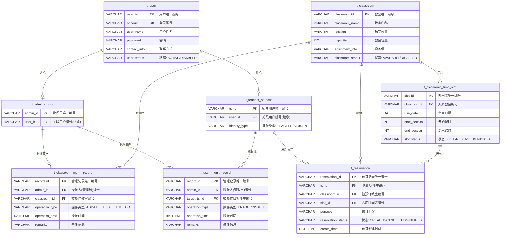

# 实验3：持久化设计（数据库建模）— 实验报告

## 基本信息

| 项目 | 内容 |
| --- | --- |
| 课程名称 | 软件工程 |
| 实验名称 | 实验3：持久化设计 |
| 班级学号 | 24201540 |
| 姓名 | 姚航 |
| 同组人员 | 无 |
| 实验日期 | 2026年 月 日 |

---

## 一、实验目的

1. 掌握从类图到数据库模型的映射方法，理解面向对象设计到关系数据库的转换过程。
2. 掌握 Power Designer 15.1 建模工具的使用，学会创建 CDM（概念数据模型）和 PDM（物理数据模型）。
3. 能够正确识别实体间的继承关系、一对多关系、多对多关系，并在数据库中合理表达。
4. 掌握视图和存储过程的设计方法，理解它们在系统中的作用。
5. 能够使用 SQL 脚本在 Power Designer 中反向工程生成 PDM。

---

## 二、实验环境

| 项目 | 说明 |
| --- | --- |
| 操作系统 | Windows 10/11 |
| 建模工具 | Power Designer 15.1 中文版 |
| 目标数据库 | MySQL 5.x / 8.0（InnoDB 引擎） |
| SQL 验证 | MySQL 8.0（已在本地/Docker 实测） |
| 反向工程 | Power Designer 15.1，DBMS = MySQL 5.0 |

---

## 三、实验要求

阅读第一次实验中的用例描述、第二次实验中的类以及类的属性，在纸上先画出 E-R 图，设计出表，找出表间关系结构，使用 Power Designer 完成 CDM 和 PDM（包括表、视图、存储过程等），截图放到实验报告中。

---

## 四、实验步骤

### 4.1 设计思路

本次实验的数据库设计遵循以下逻辑链：

```
实验1（需求分析/用例图）→ 实验2（类图）→ ER 图 → CDM → PDM → SQL 建表脚本
```

具体步骤为：

1. 从实验1的角色和用例中识别核心业务实体。
2. 从实验2的类图中提取实体属性和类间关系。
3. 在纸上画 ER 图，确定实体、属性和关系。
4. 将 ER 图映射为数据库表，确定主键、外键和索引。
5. 设计视图和存储过程。
6. 编写 MySQL 建表脚本，在 Power Designer 中使用 SQL 反向工程生成 PDM。

### 4.2 从类图中提取核心实体

根据实验2的类图设计，本系统核心实体如下：

| 序号 | 实验2类名 | 对应数据库表 | 说明 |
| --- | --- | --- | --- |
| 1 | `User` | `t_user` | 用户主表（父表） |
| 2 | `Administrator` | `t_administrator` | 管理员子表 |
| 3 | `TeacherStudentUser` | `t_teacher_student` | 师生用户子表 |
| 4 | `Classroom` | `t_classroom` | 教室资源表 |
| 5 | `ClassroomTimeSlot` | `t_classroom_time_slot` | 教室可用时间段表 |
| 6 | `Reservation` | `t_reservation` | 预订记录表（拆分师生-教室 N:M） |
| 7 | `ClassroomManagementRecord` | `t_classroom_mgmt_record` | 教室管理记录表（拆分管理员-教室 N:M） |
| 8 | `UserManagementRecord` | `t_user_mgmt_record` | 用户管理记录表（拆分管理员-师生 N:M） |

### 4.3 继承关系的数据库映射

实验2中 `Administrator` 和 `TeacherStudentUser` 继承自 `User`。

**本次采用多表继承方案：**

- 建一个用户主表 `t_user`，存放所有用户的公共属性。
- 建管理员子表 `t_administrator`，通过外键 + UNIQUE 指向 `t_user`（严格 1:1）。
- 建师生子表 `t_teacher_student`，通过外键 + UNIQUE 指向 `t_user`（严格 1:1），并存放师生独有属性。

选择多表继承的原因：

1. 管理员和师生的功能完全不同（管理员管理用户/教室，师生查询/预订）。
2. 分表后，管理记录外键直接指向管理员表，预订记录外键直接指向师生表，关联关系更清晰。
3. 与实验2类图中的继承关系完全对应。
4. 在 CDM 中可直接用继承关系表达，生成 PDM 时自动产生外键。

### 4.4 三组多对多关系拆分

本系统中存在 3 组 N:M 关系，均通过引入中间表拆分为 1:N：

| 序号 | 原始多对多关系 | 中间表 | 拆分后的两个一对多关系 |
| --- | --- | --- | --- |
| 1 | 师生 ↔ 教室（预订） | `t_reservation` | 师生 (1) → (0..*) 预订记录；预订记录 (0..*) → (1) 教室 |
| 2 | 管理员 ↔ 教室（管理） | `t_classroom_mgmt_record` | 管理员 (1) → (0..*) 教室管理记录；教室管理记录 (0..*) → (1) 教室 |
| 3 | 管理员 ↔ 师生（管理） | `t_user_mgmt_record` | 管理员 (1) → (0..*) 用户管理记录；用户管理记录 (0..*) → (1) 师生 |

### 4.5 ER 图

> （此处插入纸上手绘 ER 图照片或 Mermaid 渲染图）

ER 图的 Mermaid 代码如下（见文件 `实验3-教室预订系统ER图.mmd`）：



### 4.6 各表字段设计

#### 4.6.1 用户主表（t_user）

| 字段名 | 数据类型 | 主/外键 | 允许空 | 默认值 | 说明 |
| --- | --- | --- | --- | --- | --- |
| user_id | VARCHAR(32) | PK | 否 | — | 用户唯一编号 |
| account | VARCHAR(50) | UK | 否 | — | 登录账号（唯一） |
| user_name | VARCHAR(50) | — | 否 | — | 用户姓名 |
| password | VARCHAR(128) | — | 否 | — | 密码（哈希存储） |
| contact_info | VARCHAR(100) | — | 是 | NULL | 联系方式 |
| user_status | VARCHAR(20) | — | 否 | ACTIVE | 状态：ACTIVE/DISABLED |

#### 4.6.2 管理员子表（t_administrator）

| 字段名 | 数据类型 | 主/外键 | 允许空 | 默认值 | 说明 |
| --- | --- | --- | --- | --- | --- |
| admin_id | VARCHAR(32) | PK | 否 | — | 管理员唯一编号 |
| user_id | VARCHAR(32) | FK→t_user, UK | 否 | — | 关联用户编号（继承，唯一） |

#### 4.6.3 师生用户子表（t_teacher_student）

| 字段名 | 数据类型 | 主/外键 | 允许空 | 默认值 | 说明 |
| --- | --- | --- | --- | --- | --- |
| ts_id | VARCHAR(32) | PK | 否 | — | 师生用户唯一编号 |
| user_id | VARCHAR(32) | FK→t_user, UK | 否 | — | 关联用户编号（继承，唯一） |
| identity_type | VARCHAR(20) | — | 否 | — | 身份类型：TEACHER/STUDENT |

#### 4.6.4 教室表（t_classroom）

| 字段名 | 数据类型 | 主/外键 | 允许空 | 默认值 | 说明 |
| --- | --- | --- | --- | --- | --- |
| classroom_id | VARCHAR(32) | PK | 否 | — | 教室唯一编号 |
| classroom_name | VARCHAR(50) | — | 否 | — | 教室名称 |
| location | VARCHAR(100) | — | 否 | — | 教室位置 |
| capacity | INT | — | 否 | — | 教室容量（座位数） |
| equipment_info | VARCHAR(200) | — | 是 | NULL | 设备信息 |
| classroom_status | VARCHAR(20) | — | 否 | AVAILABLE | 状态：AVAILABLE/DISABLED |

#### 4.6.5 教室可用时间段表（t_classroom_time_slot）

| 字段名 | 数据类型 | 主/外键 | 允许空 | 默认值 | 说明 |
| --- | --- | --- | --- | --- | --- |
| slot_id | VARCHAR(32) | PK | 否 | — | 时间段唯一编号 |
| classroom_id | VARCHAR(32) | FK→t_classroom | 否 | — | 所属教室编号 |
| use_date | DATE | — | 否 | — | 使用日期 |
| start_section | INT | — | 否 | — | 开始课时（如第1节） |
| end_section | INT | — | 否 | — | 结束课时（如第4节） |
| slot_status | VARCHAR(20) | — | 否 | FREE | 状态：FREE/RESERVED/UNAVAILABLE |

**业务规则：** start_section ≤ end_section；同一教室同一日期的时间段不应重叠（在存储过程中校验）。

#### 4.6.6 预订记录表（t_reservation）

| 字段名 | 数据类型 | 主/外键 | 允许空 | 默认值 | 说明 |
| --- | --- | --- | --- | --- | --- |
| reservation_id | VARCHAR(32) | PK | 否 | — | 预订记录唯一编号 |
| ts_id | VARCHAR(32) | FK→t_teacher_student | 否 | — | 申请人（师生用户编号） |
| classroom_id | VARCHAR(32) | FK→t_classroom | 否 | — | 被预订教室编号 |
| slot_id | VARCHAR(32) | FK→t_classroom_time_slot | 否 | — | 占用时间段编号 |
| purpose | VARCHAR(200) | — | 是 | NULL | 预订用途 |
| reservation_status | VARCHAR(20) | — | 否 | CREATED | 状态：CREATED/CANCELLED/FINISHED |
| create_time | DATETIME | — | 否 | — | 预订创建时间 |

#### 4.6.7 教室管理记录表（t_classroom_mgmt_record）

| 字段名 | 数据类型 | 主/外键 | 允许空 | 默认值 | 说明 |
| --- | --- | --- | --- | --- | --- |
| record_id | VARCHAR(32) | PK | 否 | — | 管理记录唯一编号 |
| admin_id | VARCHAR(32) | FK→t_administrator | 否 | — | 操作人（管理员编号） |
| classroom_id | VARCHAR(32) | FK→t_classroom | 否 | — | 被操作教室编号 |
| operation_type | VARCHAR(20) | — | 否 | — | 操作类型：ADD/DELETE/SET_TIMESLOT |
| operation_time | DATETIME | — | 否 | — | 操作时间 |
| remarks | VARCHAR(500) | — | 是 | NULL | 备注信息 |

#### 4.6.8 用户管理记录表（t_user_mgmt_record）

| 字段名 | 数据类型 | 主/外键 | 允许空 | 默认值 | 说明 |
| --- | --- | --- | --- | --- | --- |
| record_id | VARCHAR(32) | PK | 否 | — | 管理记录唯一编号 |
| admin_id | VARCHAR(32) | FK→t_administrator | 否 | — | 操作人（管理员编号） |
| target_ts_id | VARCHAR(32) | FK→t_teacher_student | 否 | — | 被操作目标师生用户编号 |
| operation_type | VARCHAR(20) | — | 否 | — | 操作类型：ENABLE/DISABLE |
| operation_time | DATETIME | — | 否 | — | 操作时间 |
| remarks | VARCHAR(500) | — | 是 | NULL | 备注信息 |

### 4.7 主外键关系汇总

| 序号 | 关系类型 | 外键所在表 | 外键字段 | 引用表 | 引用字段 | 多重性 | 说明 |
| --- | --- | --- | --- | --- | --- | --- | --- |
| 1 | 继承 | t_administrator | user_id | t_user | user_id | 1:1 | 管理员继承自用户 |
| 2 | 继承 | t_teacher_student | user_id | t_user | user_id | 1:1 | 师生继承自用户 |
| 3 | 从属 | t_classroom_time_slot | classroom_id | t_classroom | classroom_id | 1:N | 教室包含多个时间段 |
| 4 | 关联 | t_reservation | ts_id | t_teacher_student | ts_id | 1:N | 师生发起多条预订 |
| 5 | 关联 | t_reservation | classroom_id | t_classroom | classroom_id | 1:N | 多条预订指向同一教室 |
| 6 | 关联 | t_reservation | slot_id | t_classroom_time_slot | slot_id | 1:N | 每条预订占用一个时间段 |
| 7 | 关联 | t_classroom_mgmt_record | admin_id | t_administrator | admin_id | 1:N | 教室管理由管理员发起 |
| 8 | 关联 | t_classroom_mgmt_record | classroom_id | t_classroom | classroom_id | 1:N | 教室管理针对教室 |
| 9 | 关联 | t_user_mgmt_record | admin_id | t_administrator | admin_id | 1:N | 用户管理由管理员发起 |
| 10 | 关联 | t_user_mgmt_record | target_ts_id | t_teacher_student | ts_id | 1:N | 用户管理针对师生 |

### 4.8 索引设计

| 表 | 索引名 | 字段 | 类型 | 用途 |
| --- | --- | --- | --- | --- |
| t_user | uk_user_account | account | UNIQUE | 登录账号唯一 + 登录查询 |
| t_user | idx_user_status | user_status | 普通 | 按状态筛选用户 |
| t_administrator | uk_admin_user | user_id | UNIQUE | 1:1 继承约束 + 外键查询 |
| t_teacher_student | uk_ts_user | user_id | UNIQUE | 1:1 继承约束 + 外键查询 |
| t_teacher_student | idx_ts_identity_type | identity_type | 普通 | 按教师/学生筛选 |
| t_classroom | idx_classroom_status | classroom_status | 普通 | 按状态筛选教室 |
| t_classroom_time_slot | idx_slot_classroom_date | classroom_id, use_date | 复合 | 按教室+日期查时间段 |
| t_classroom_time_slot | idx_slot_date_status | use_date, slot_status | 复合 | "查某日空闲教室"核心查询 |
| t_reservation | idx_reservation_ts | ts_id | 普通 | 查某师生的预订 |
| t_reservation | idx_reservation_classroom_slot | classroom_id, slot_id | 复合 | 预订冲突/教室维度查询 |
| t_reservation | idx_reservation_status | reservation_status | 普通 | 按预订状态筛选 |
| t_reservation | idx_reservation_create_time | create_time | 普通 | 按时间排序/统计 |
| t_classroom_mgmt_record | idx_classroom_mgmt_admin | admin_id | 普通 | 按管理员查记录 |
| t_classroom_mgmt_record | idx_classroom_mgmt_classroom | classroom_id | 普通 | 按教室查记录 |
| t_classroom_mgmt_record | idx_classroom_mgmt_time | operation_time | 普通 | 按时间查记录 |
| t_user_mgmt_record | idx_user_mgmt_admin | admin_id | 普通 | 按管理员查记录 |
| t_user_mgmt_record | idx_user_mgmt_target | target_ts_id | 普通 | 按目标师生查记录 |
| t_user_mgmt_record | idx_user_mgmt_time | operation_time | 普通 | 按时间查记录 |

### 4.9 视图设计

#### 视图1：v_available_classroom（空闲教室查询视图）

**用途：** 对应用例"浏览空闲教室"，将可用教室和空闲时间段联接，供师生直接查询。

```sql
CREATE VIEW v_available_classroom AS
SELECT
    c.classroom_id, c.classroom_name, c.location, c.capacity, c.equipment_info,
    ts.slot_id, ts.use_date, ts.start_section, ts.end_section
FROM t_classroom c
JOIN t_classroom_time_slot ts ON c.classroom_id = ts.classroom_id
WHERE c.classroom_status = 'AVAILABLE'
  AND ts.slot_status = 'FREE';
```

#### 视图2：v_reservation_detail（预订情况查询视图）

**用途：** 对应用例"浏览教室预订情况"，多表联查汇总预订明细，供管理员查看。

```sql
CREATE VIEW v_reservation_detail AS
SELECT
    r.reservation_id,
    u.user_name    AS applicant_name,
    u.account      AS applicant_account,
    t.identity_type,
    c.classroom_name, c.location,
    ts.use_date, ts.start_section, ts.end_section,
    r.purpose, r.reservation_status, r.create_time
FROM t_reservation r
JOIN t_teacher_student t ON r.ts_id = t.ts_id
JOIN t_user u           ON t.user_id = u.user_id
JOIN t_classroom c      ON r.classroom_id = c.classroom_id
JOIN t_classroom_time_slot ts ON r.slot_id = ts.slot_id;
```

### 4.10 存储过程设计

#### 存储过程1：sp_reserve_classroom（预订教室）

**用途：** 在一个事务内完成教室预订，通过 `SELECT ... FOR UPDATE` 锁定时间段，防止并发环境下同一时段被重复预订。

```sql
DELIMITER $$
CREATE PROCEDURE sp_reserve_classroom(
    IN  p_reservation_id VARCHAR(32),
    IN  p_ts_id          VARCHAR(32),
    IN  p_slot_id        VARCHAR(32),
    IN  p_purpose        VARCHAR(200),
    OUT p_result         INT  -- 1=成功, 0=时段不可用, -1=异常
)
BEGIN
    DECLARE v_classroom_id VARCHAR(32);
    DECLARE v_slot_status  VARCHAR(20);

    DECLARE EXIT HANDLER FOR SQLEXCEPTION
    BEGIN
        ROLLBACK;
        SET p_result = -1;
    END;

    START TRANSACTION;

    SELECT classroom_id, slot_status
      INTO v_classroom_id, v_slot_status
      FROM t_classroom_time_slot
     WHERE slot_id = p_slot_id
     FOR UPDATE;

    IF v_slot_status = 'FREE' THEN
        INSERT INTO t_reservation(reservation_id, ts_id, classroom_id, slot_id,
                                  purpose, reservation_status, create_time)
        VALUES (p_reservation_id, p_ts_id, v_classroom_id, p_slot_id,
                p_purpose, 'CREATED', NOW());

        UPDATE t_classroom_time_slot SET slot_status = 'RESERVED'
         WHERE slot_id = p_slot_id;

        SET p_result = 1;
        COMMIT;
    ELSE
        SET p_result = 0;
        ROLLBACK;
    END IF;
END$$
DELIMITER ;
```

#### 存储过程2：sp_cancel_reservation（取消预订）

**用途：** 将预订状态置为已取消，并释放对应时间段为空闲。

```sql
DELIMITER $$
CREATE PROCEDURE sp_cancel_reservation(
    IN  p_reservation_id VARCHAR(32),
    OUT p_result         INT
)
BEGIN
    DECLARE v_slot_id            VARCHAR(32);
    DECLARE v_reservation_status VARCHAR(20);

    DECLARE EXIT HANDLER FOR SQLEXCEPTION
    BEGIN
        ROLLBACK;
        SET p_result = -1;
    END;

    START TRANSACTION;

    SELECT slot_id, reservation_status
      INTO v_slot_id, v_reservation_status
      FROM t_reservation
     WHERE reservation_id = p_reservation_id
     FOR UPDATE;

    IF v_reservation_status = 'CREATED' THEN
        UPDATE t_reservation SET reservation_status = 'CANCELLED'
         WHERE reservation_id = p_reservation_id;

        UPDATE t_classroom_time_slot SET slot_status = 'FREE'
         WHERE slot_id = v_slot_id;

        SET p_result = 1;
        COMMIT;
    ELSE
        SET p_result = 0;
        ROLLBACK;
    END IF;
END$$
DELIMITER ;
```

#### 存储过程3：sp_query_available_classroom（按日期查询空闲教室）

**用途：** 演示带查询结果集的存储过程，按指定日期返回所有空闲教室和可用时间段。

```sql
DELIMITER $$
CREATE PROCEDURE sp_query_available_classroom(IN p_use_date DATE)
BEGIN
    SELECT c.classroom_id, c.classroom_name, c.location, c.capacity, c.equipment_info,
           ts.slot_id, ts.use_date, ts.start_section, ts.end_section
    FROM t_classroom c
    JOIN t_classroom_time_slot ts ON c.classroom_id = ts.classroom_id
    WHERE c.classroom_status = 'AVAILABLE'
      AND ts.slot_status = 'FREE'
      AND ts.use_date = p_use_date
    ORDER BY c.classroom_id, ts.start_section;
END$$
DELIMITER ;
```

### 4.11 使用 SQL 反向工程在 Power Designer 中生成 PDM

由于本次实验已编写好 MySQL 建表脚本（含表、视图、存储过程），可直接在 Power Designer 15.1 中通过 SQL 反向工程生成 PDM，步骤如下：

1. 打开 Power Designer 15.1，菜单 **文件** → **反向工程** → **数据库...**
2. 在弹出窗口中，**DBMS** 选择 **MySQL 5.0**，Model name 填"教室预订系统PDM"。
3. 选择反向来源为 **Using script files**，点 **Add** 添加 `实验3-教室预订系统建表脚本.sql`。
4. 点 **确定**，PD 自动解析并生成 8 张表 + 外键连线 + 2 个视图 + 3 个存储过程。
5. 在画布中调整表布局（`t_user` 放顶部，子表和中间表按关联关系分布）。
6. 保存 PDM 文件。

> **注意：** 若存储过程未被正确导入为 Procedure 对象，可改用"连接数据库反向工程"（先在 MySQL 中执行脚本建好库，再用 PD 的 Database → Reverse Engineer → Using a data source 连库反向），或在 PDM 中手动新建 Procedure 粘贴过程体。

---

## 五、实验结果

### 5.1 CDM 概念数据模型

> （此处插入 Power Designer 中 CDM 全图截图）

CDM 中包含 8 个实体，其中 User 通过继承关系连接 Administrator 和 TeacherStudent；其余实体通过普通关系连接，10 条关系完整体现了多对多拆分设计。

### 5.2 PDM 物理数据模型

> （此处插入 Power Designer 中 PDM 全图截图，展示 8 张表和外键连线）

PDM 由 SQL 反向工程自动生成，包含：

- 8 张数据表（InnoDB 引擎，utf8 字符集）
- 10 条外键关系
- 各表含主键、唯一键、普通索引

### 5.3 表结构截图（以 t_reservation 为例）

> （此处插入 Power Designer 中双击 t_reservation 表后的字段定义截图）

### 5.4 视图定义截图

> （此处插入 Power Designer 中视图 v_available_classroom 的 SQL 定义截图）
>
> （此处插入 Power Designer 中视图 v_reservation_detail 的 SQL 定义截图）

### 5.5 存储过程定义截图

> （此处插入 Power Designer 中存储过程 sp_reserve_classroom 的定义截图）
>
> （此处插入 Power Designer 中存储过程 sp_cancel_reservation 的定义截图）
>
> （此处插入 Power Designer 中存储过程 sp_query_available_classroom 的定义截图）

### 5.6 MySQL 实测验证

建表脚本已在 MySQL 8.0 中实际执行验证，结果如下：

| 验证项 | 结果 |
| --- | --- |
| 8 张表创建 | 成功 |
| 10 条外键关系 | 正确建立 |
| 2 个视图创建 | 成功 |
| 3 个存储过程创建 | 成功 |
| sp_reserve_classroom 首次预订 | 返回 1，时段变为 RESERVED |
| sp_reserve_classroom 同一时段二次预订 | 返回 0（被拦截，防重复预订） |
| sp_cancel_reservation 取消预订 | 返回 1，时段恢复 FREE |
| 取消后再次预订同一时段 | 返回 1（成功） |

### 5.7 数据库设计与业务需求的对应关系

| 需求功能 | 涉及的数据表 | 说明 |
| --- | --- | --- |
| 登录系统 | t_user | 根据 account + password 校验 |
| 修改密码 | t_user | 更新 password 字段 |
| 增加用户 | t_user, t_teacher_student, t_user_mgmt_record | 插入用户和师生记录，生成管理日志 |
| 删除/停用用户 | t_user, t_user_mgmt_record, t_reservation | 更新用户状态，处理关联预订，生成管理日志 |
| 增加教室 | t_classroom, t_classroom_mgmt_record | 插入教室记录，生成管理日志 |
| 删除/停用教室 | t_classroom, t_classroom_mgmt_record, t_reservation | 更新教室状态，处理关联预订，生成管理日志 |
| 设置可用时间段 | t_classroom_time_slot, t_classroom_mgmt_record | 插入时间段记录，生成管理日志 |
| 浏览空闲教室 | 视图 v_available_classroom | 按日期/课时查询空闲 |
| 预订教室 | sp_reserve_classroom 存储过程 | 事务内防重复预订 |
| 取消预订 | sp_cancel_reservation 存储过程 | 释放时间段 |
| 浏览预订情况 | 视图 v_reservation_detail | 多表联查汇总明细 |

### 5.8 时间精确到"课时"的体现

- `t_classroom_time_slot` 表使用 `start_section`（开始课时）和 `end_section`（结束课时）两个整数字段。
- 课时以整数编号，如第1节、第2节……第10节。
- 冲突校验通过比较同一教室、同一日期下的课时范围是否重叠来实现。

### 5.9 并发性能设计考虑

- 对高频查询字段建立索引（特别是 `(use_date, slot_status)` 复合索引）。
- 预订存储过程使用 `SELECT ... FOR UPDATE` + 事务保证原子性和一致性。
- 通过行级锁防止同一时段被并发重复预订。

---

## 六、实验体会

通过本次实验，我掌握了以下内容：

1. **从类图到数据库的映射方法。** 实验2的类图中的继承关系（User → Administrator / TeacherStudent）通过多表继承方案+外键+UNIQUE映射到数据库中，多对多关系通过引入中间表拆分为两个一对多。
2. **Power Designer 的使用。** 学会了在 PD 15.1 中使用 MySQL SQL 脚本反向工程生成 PDM，生成的模型自动包含表结构、外键关系、视图和存储过程。
3. **存储过程的设计。** 存储过程 `sp_reserve_classroom` 通过事务 + 行级锁实现了"防止同一时段重复预订"的业务需求，体现了数据库层面对并发安全的保障。
4. **视图的作用。** 通过建立查询视图，把多表联查封装为统一视口，简化了应用层代码、提高了复用性。
5. **四个实验之间的衔接。** 实验3的每张表、每个字段都能追溯到实验1的用例和实验2的类图，保证了整套设计的前后一致性。

本次实验中最有收获的部分是理解了多对多关系在数据库中必须通过中间表拆分，以及存储过程如何利用事务和行级锁来保证并发安全。这些是实际项目开发中非常重要的能力。
