# 实验四　教室预订系统用户界面设计

> 课程：软件工程实验　　实验名称：用户界面设计（Axure RP 8 原型设计）

---

## 一、实验目的

1. 掌握软件用户界面（UI）设计的基本方法、流程与原则，理解"以用户和功能为中心"的设计思想。
2. 学会使用 **Axure RP 8** 进行界面原型（线框图 Wireframe）设计，熟悉 Pages（页面树）、Widgets（控件）、Masters（母版）、Repeater（中继器）以及页面交互的使用。
3. 能够依据**实验一的需求分析（用例、参与者、业务规则）**和**实验三的数据库设计（数据表、字段、状态值）**，将抽象需求转化为可视化、可交互的界面原型。
4. 学会以**控件命名 + 编号标注 + 注释说明**的规范方式，把每个界面元素的功能与数据元素的约束规则（必填、长度、范围、格式、唯一性、错误提示等）描述清楚，使后续接手者（开发/测试人员）无需猜测即可正确实现。

---

## 二、实验要求

1. 根据实验指导书和前面的需求分析，使用 **Axure RP 8** 画出系统界面。
2. 界面必须包含**完整的界面元素**（输入框、下拉框、按钮、表格、链接等）以及**对界面上数据元素的说明**（每个数据项的含义与约束规则）。
3. 设计的**界面数量不得少于 5 个**。
4. 将完成的界面**截图**放入实验报告中。

---

## 三、实验步骤

1. **复习前置成果**：回顾实验一的用例图与需求规格（角色：管理员、师生用户；功能：登录、修改密码、查询空闲教室、预订教室、查看/取消预订、用户管理、教室管理、时间段设置、预订情况查询），以及实验三的数据库结构（`t_user`、`t_classroom`、`t_classroom_time_slot`、`t_reservation` 等表及其字段、状态值）。
2. **梳理页面清单（Sitemap）与角色导航**：确定系统需要的全部页面，并区分公共页面、师生端页面、管理员端页面，明确登录后按角色自动跳转。
3. **新建 Axure 工程**：在 Axure RP 8 中建立 Pages 页面树，按"公共页面 / 师生端 / 管理员端"分组组织页面。
4. **逐页绘制界面元素**：从控件库拖放输入框、下拉框、按钮、表格（数据多时用 Repeater 中继器）、链接等控件，并在每个控件右上角设置**控件名称（widget name）**，便于与说明对应。
5. **添加数据元素说明**：在每个控件旁放置**红色编号圆圈**，并在右侧用**黄色注释框**逐条写明该控件的功能、必填性、长度/范围/格式、唯一性/边界、各类错误提示文案与校验顺序。
6. **公共功能做成母版（Master）**：将"修改密码"等师生与管理员共用的表单做成母版，多个页面复用，仅顶部导航栏不同，避免重复设计。
7. **设置页面交互**：为登录、菜单导航、预订/取消、新增/停用等操作配置页面跳转与提示交互。
8. **预览、截图、整理报告**：在浏览器中预览各页面，截图后整理为本实验报告。

> 说明：因 Axure RP 8 为 Windows 桌面软件，本实验先用等价的线框原型（灰色线框 + 黄色注释框 + 红色编号 + 蓝色控件名）确定全部界面元素、布局与数据规则，作为在 Axure 中复刻的参照；下列截图即按 Axure 导出风格制作。

---

## 四、实验内容

### 4.1 系统页面清单（Sitemap）

| 分组 | 页面 | 主要使用角色 |
|---|---|---|
| 公共页面 | ① 登录页　② 修改密码页 | 全体 / 已登录用户 |
| 师生端 | ③ 师生首页　④ 空闲教室查询页　⑤ 教室预订页　⑥ 我的预订页 | 师生用户 |
| 管理员端 | ⑦ 管理员首页　⑧ 用户管理页　⑨ 教室管理页　⑩ 可用时间段设置页　⑪ 预订情况查询页 | 管理员 |

> 共 **11 个界面**（满足"不少于 5 个"的要求）。系统**无自助注册**：账号由管理员统一创建分配。**修改密码为所有已登录用户（师生与管理员）共用的同一个界面**，不区分角色。

### 4.2 与需求分析、数据库设计的对应关系

| 界面数据元素 | 对应数据库字段 | 约束规则（摘要） |
|---|---|---|
| 登录账号 | `t_user.account` | 必填、4~20 位、字母/数字/下划线、全局唯一 |
| 密码 | `t_user.password` | 必填、6~20 位、掩码显示 |
| 身份类型 | `t_user.identity_type` | 必选：教师/学生，创建后不可改 |
| 用户状态 | `t_user.user_status` | 正常(ACTIVE)/已停用(DISABLED) |
| 教室容量 | `t_classroom.capacity` | 必填、正整数、1~500 |
| 教室状态 | `t_classroom.classroom_status` | 可用(AVAILABLE)/已停用 |
| 开始/结束课时 | `start_section` / `end_section` | 第1~12节、结束≥开始 |
| 时段状态 | `slot_status` | 空闲(FREE)/已预订 |
| 预订状态 | `t_reservation.reservation_status` | 已创建/已完成/已取消 |

### 4.3 各界面元素与数据元素说明（含截图）

> 每张截图中：**蓝色文字**为控件名称（Axure widget name）；**红色编号①②③…**标注控件位置；**黄色框**逐条说明该控件的功能与数据规则。

---

#### 界面 1：登录页

系统入口。用户输入账号、密码登录，系统按角色自动跳转到对应首页。

| 编号 | 控件 | 数据元素说明 |
|---|---|---|
| ① | 账号输入框 | 必填，4~20 位，字母/数字/下划线，全局唯一；不存在→"该账号不存在" |
| ② | 密码输入框 | 必填，6~20 位，掩码显示；不匹配→"密码错误" |
| ③ | 登录按钮 | 校验非空→账号存在→密码匹配→状态正常；通过后按角色跳转；停用→"该账号已被停用" |
| ④ | 重置按钮 | 清空账号、密码，恢复初始状态 |

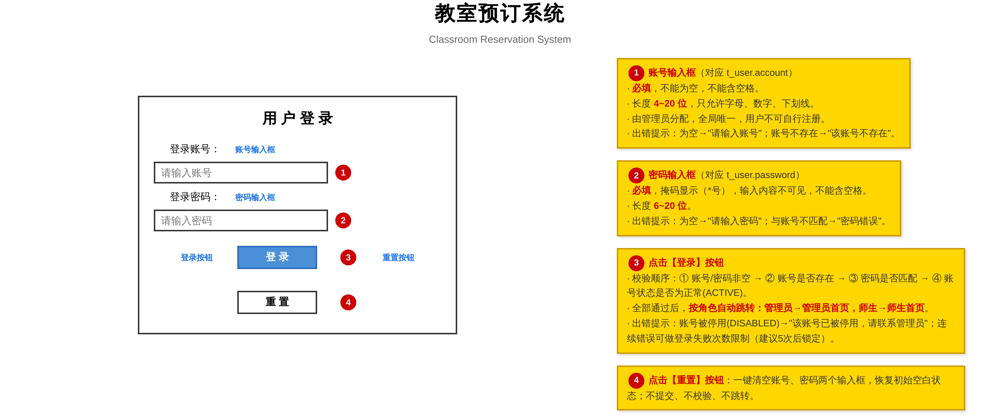

---

#### 界面 2：修改密码页（师生与管理员共用）

所有已登录用户共用的同一界面，不区分角色；当前账号只读，需校验旧密码并两次输入新密码。

| 编号 | 控件 | 数据元素说明 |
|---|---|---|
| ① | 旧密码输入框 | 必填，掩码；须等于当前密码；错误→"旧密码不正确" |
| ② | 新密码输入框 | 必填，6~20 位，不含空格，不能与旧密码相同 |
| ③ | 确认密码输入框 | 必填，须与新密码完全一致（区分大小写） |
| ④ | 保存修改按钮 | 依次校验非空→旧密码→新密码格式→新≠旧→两次一致；通过后确认生效 |

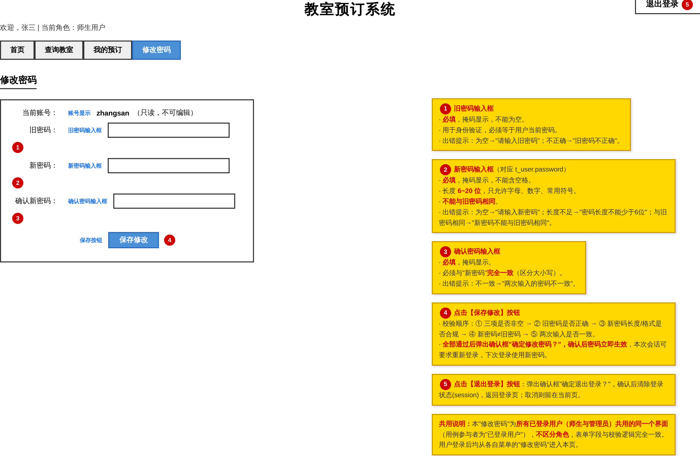

---

#### 界面 3：师生首页

师生登录后的功能入口，仅展示师生权限范围内的功能（查询教室、我的预订、修改密码）。

| 编号 | 控件 | 数据元素说明 |
|---|---|---|
| ① | 查询教室入口 | 跳转空闲教室查询页 |
| ② | 我的预订入口 | 跳转我的预订页 |
| ③ | 修改密码入口 | 跳转修改密码页 |

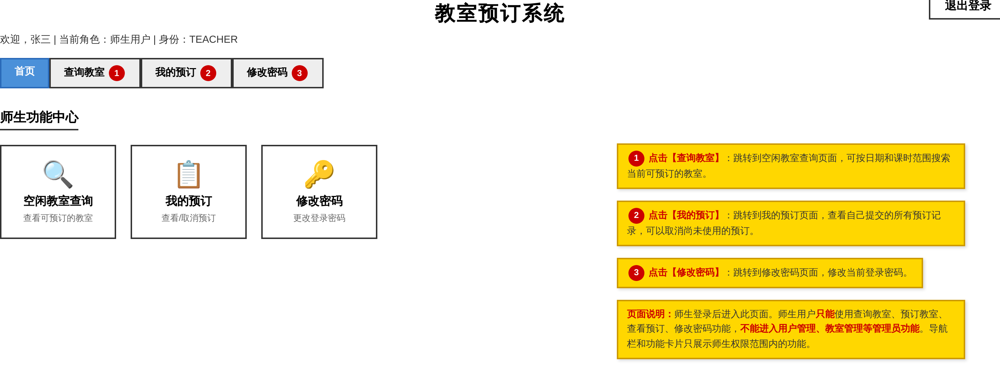

---

#### 界面 4：空闲教室查询页

按日期、课时范围及可选条件查询"当前可用且时段空闲"的教室。

| 编号 | 控件 | 数据元素说明 |
|---|---|---|
| ① | 日期选择框 | 必填，不能早于今天 |
| ②③ | 开始/结束课时下拉框 | 第1~12节；结束≥开始 |
| ④ | 位置输入框 | 选填，模糊匹配 |
| ⑤ | 最低容量输入框 | 选填，正整数 |
| ⑥ | 查询按钮 | 空闲=教室可用 且 时段空闲（两条件缺一不可）；无结果提示 |
| ⑦ | 预订链接 | 跳转预订页并自动带入该行信息 |

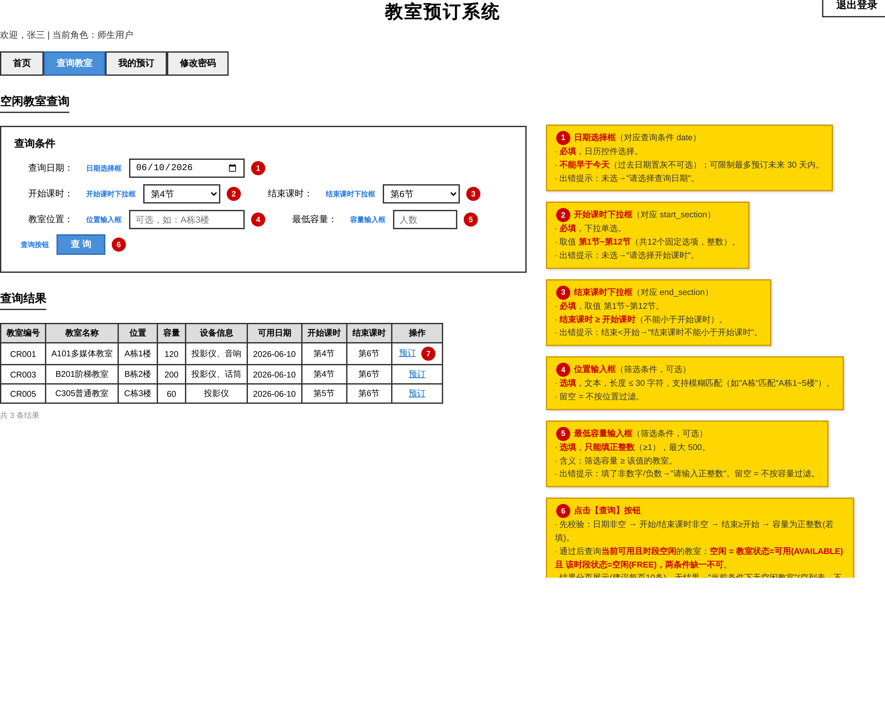

---

#### 界面 5：教室预订页

确认自动带入的教室与时段信息，填写用途后提交预订；提交时再次校验时段冲突。

| 编号 | 控件 | 数据元素说明 |
|---|---|---|
| ① | 预订信息确认区 | 教室/日期/课时等只读，由上一页带入 |
| ② | 申请人 | 自动填入当前登录用户，只读 |
| ③ | 用途输入框 | 选填，≤200 字 |
| ④ | 提交预订按钮 | 确认→校验时段仍空闲→成功显示编号；冲突→"时段冲突，预订失败" |
| ⑤ | 返回查询按钮 | 不提交，返回查询页 |
| ⑥⑦ | 成功/失败提示 | 成功显示预订编号与状态；失败显示原因 |

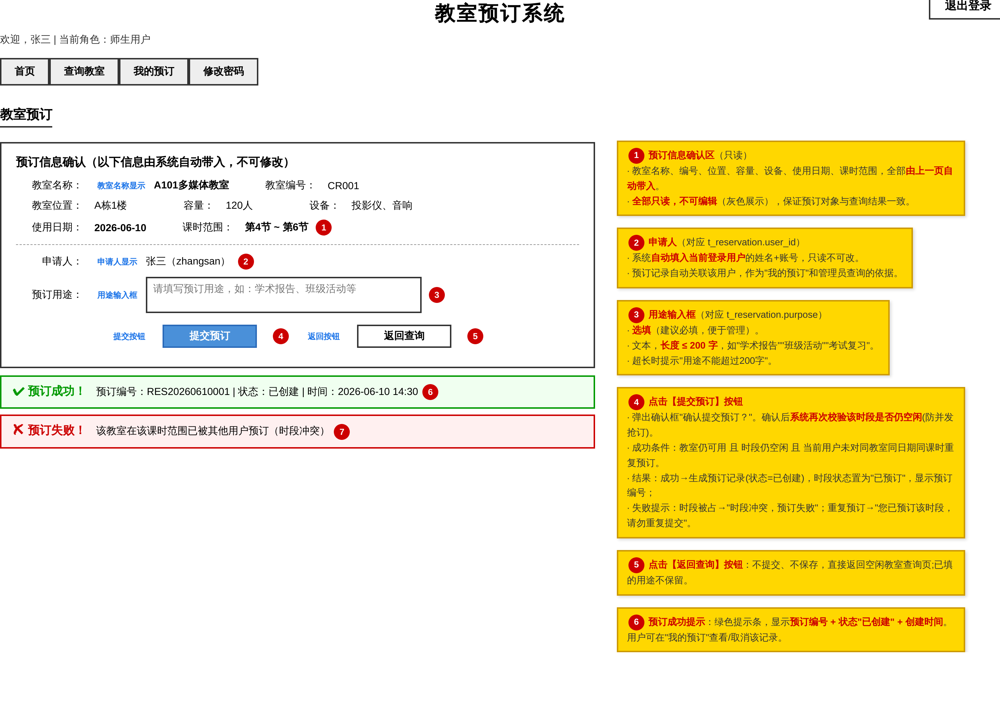

---

#### 界面 6：我的预订页

展示当前用户自己的预订记录，可取消尚未使用的预订。

| 编号 | 控件 | 数据元素说明 |
|---|---|---|
| ① | 取消链接 | 仅"已创建"且未到期的预订显示；取消后时段恢复空闲 |
| — | 状态列 | 已创建（绿）/已完成（灰）/已取消（红） |

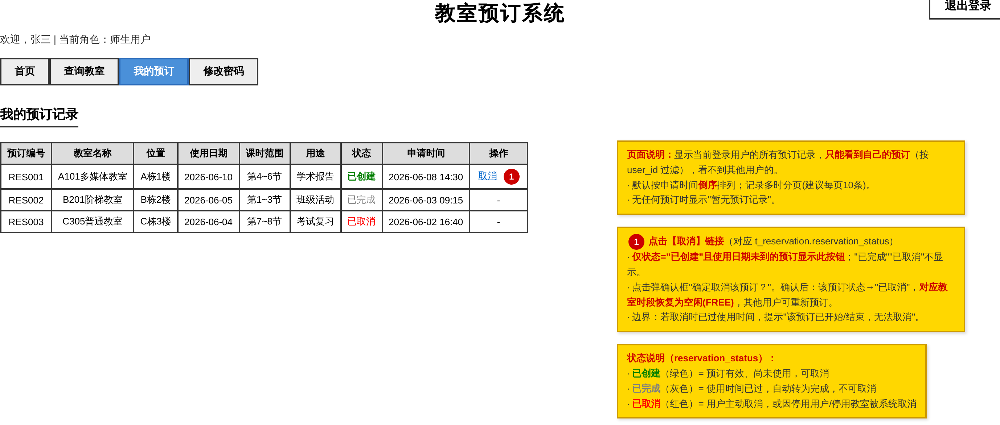

---

#### 界面 7：管理员首页

管理员登录后的控制台，导航与师生端完全不同，包含全部管理功能入口。

| 编号 | 控件 | 数据元素说明 |
|---|---|---|
| ①②③④ | 用户管理 / 教室管理 / 时间段设置 / 预订查询入口 | 分别跳转对应管理页面 |

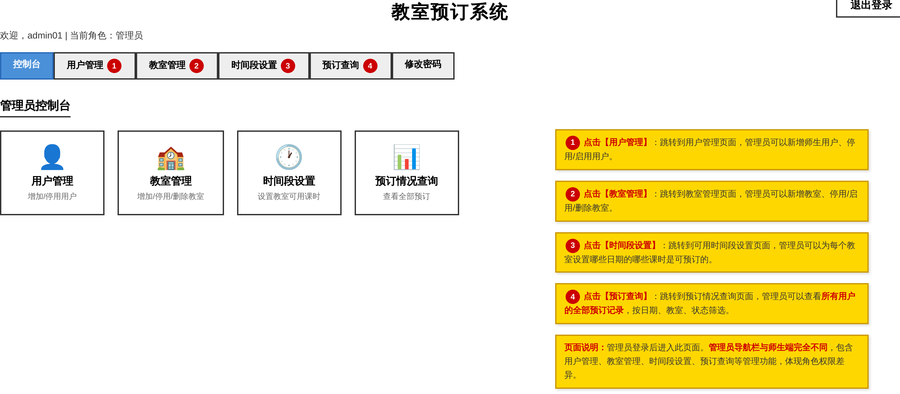

---

#### 界面 8：用户管理页

管理员新增师生用户、停用/启用用户。

| 编号 | 控件 | 数据元素说明 |
|---|---|---|
| ① | 搜索框/按钮 | 按账号或姓名模糊匹配；留空显示全部 |
| ② | 新增用户按钮 | 展开新增表单 |
| ③ | 停用链接 | 有未完成预订需二次确认并自动取消；逻辑删除 |
| ④ | 启用链接 | 已停用用户恢复正常，可重新登录 |
| ⑤~⑧ | 新增用户表单 | 账号(唯一,4~20位)、姓名(2~20)、初始密码(6~20)、身份(必选)、手机号(11位) |

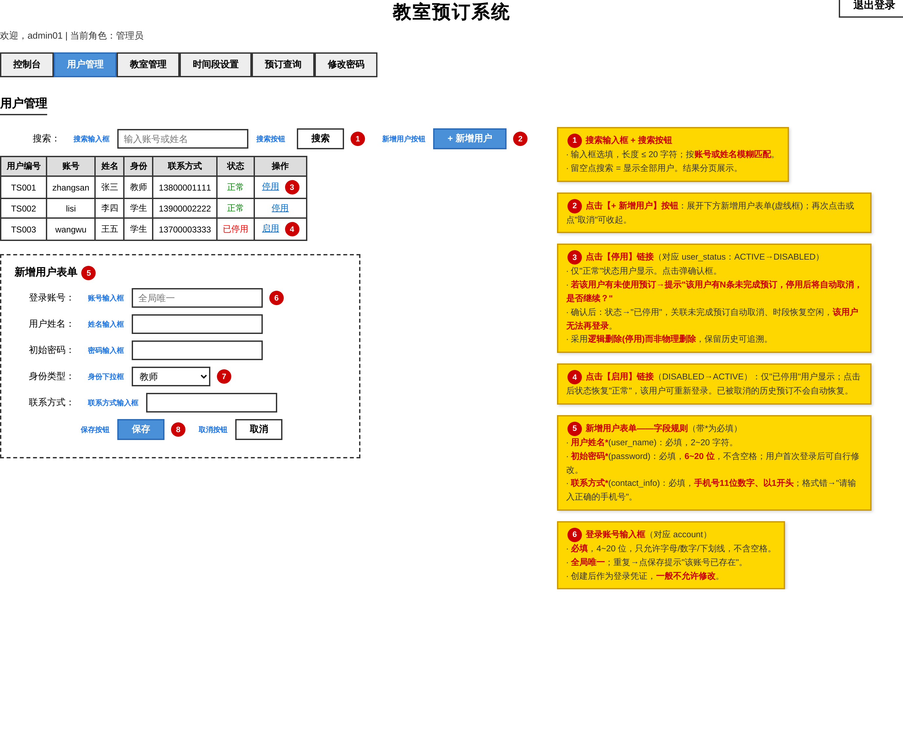

---

#### 界面 9：教室管理页

管理员新增教室、停用/启用/删除教室。

| 编号 | 控件 | 数据元素说明 |
|---|---|---|
| ① | 搜索框/按钮 | 按名称或位置模糊匹配 |
| ② | 新增教室按钮 | 展开新增表单，状态默认可用 |
| ③ | 停用链接 | 有未来预订需二次确认并自动取消 |
| ④ | 设置时段链接 | 仅可用教室显示，跳转时段设置页 |
| ⑤ | 删除链接 | 仅已停用教室可删；不可恢复 |
| ⑥⑦⑧ | 新增教室表单 | 名称(2~30)、位置、容量(正整数1~500)、设备(选填)；编号自动生成 |

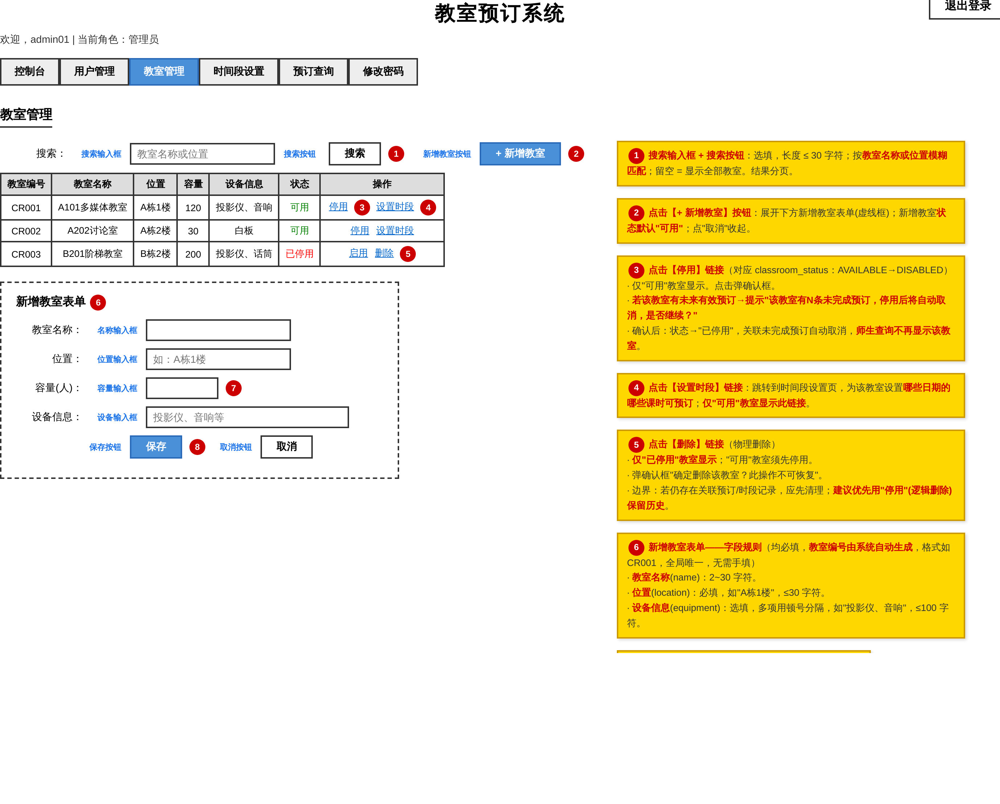

---

#### 界面 10：可用时间段设置页

管理员为指定教室设置某日期开放预订的课时段。

| 编号 | 控件 | 数据元素说明 |
|---|---|---|
| ① | 教室下拉框 | 仅"可用"教室出现 |
| ② | 日期选择框 | 必填，不早于今天 |
| ③④ | 开始/结束课时下拉框 | 第1~12节；结束≥开始 |
| ⑤ | 添加时段按钮 | 检测同教室同日期时段重叠；冲突→"与已有时段冲突，无法添加" |
| ⑥ | 置为不可用链接 | 仅空闲时段可操作 |
| ⑦ | 删除链接 | 仅空闲时段可删 |
| ⑧ | 不可操作说明 | 已预订时段不可改/删 |

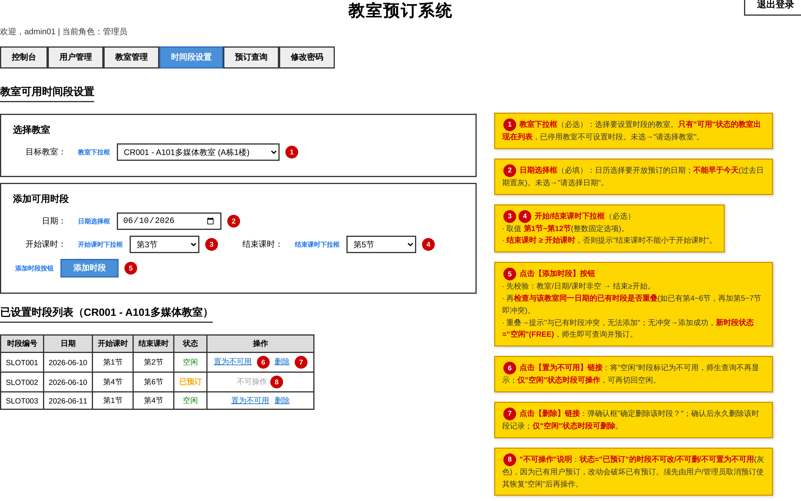

---

#### 界面 11：预订情况查询页

管理员按日期范围、教室、状态查询全部用户的预订记录。

| 编号 | 控件 | 数据元素说明 |
|---|---|---|
| ①② | 起始/截止日期 | 可留空；截止≥起始 |
| ③ | 教室下拉框 | 全部教室或指定教室 |
| ④ | 状态下拉框 | 全部/已创建/已完成/已取消 |
| ⑤ | 查询按钮 | 管理员可查所有用户预订；分页展示，无结果提示 |

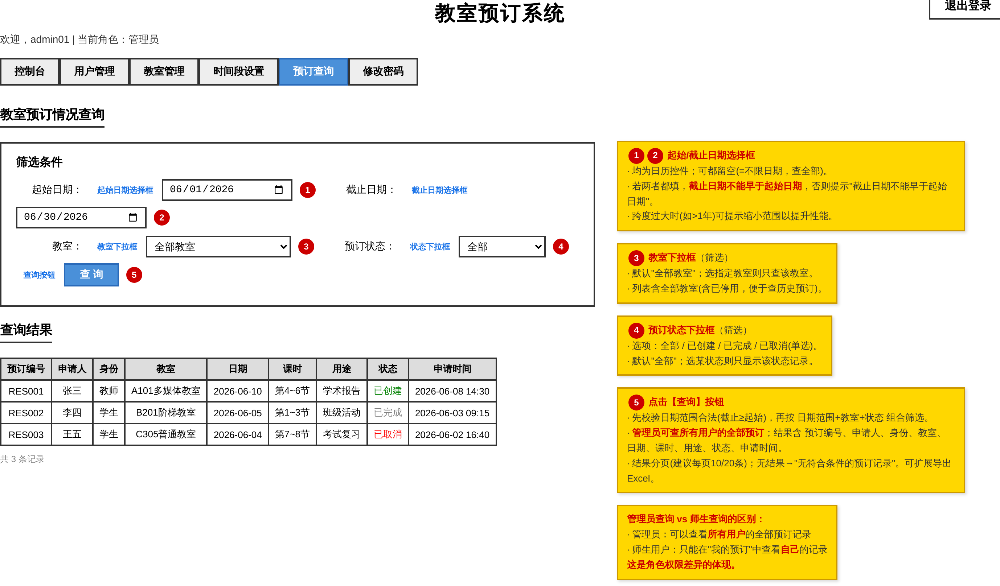

---

## 五、实验结果

1. 完成了教室预订系统的全部 **11 个界面**（远超"不少于 5 个"的要求），覆盖公共页面（登录、修改密码）、师生端（首页、空闲教室查询、教室预订、我的预订）、管理员端（首页、用户管理、教室管理、时间段设置、预订情况查询）。
2. 每个界面都包含**完整的界面元素**（输入框、下拉框、按钮、表格、链接等）并配有**控件名称 + 编号标注 + 黄色注释框**，对每一个数据元素的**功能、必填性、长度/范围/格式、唯一性/边界、错误提示及校验顺序**都做了清晰说明，可直接作为后续开发与测试的依据。
3. 界面设计与实验一需求、实验三数据库严格对齐：字段命名一致、状态值一致、业务规则一致（如空闲=教室可用且时段空闲、课时第1~12节且结束≥开始、时段不重叠、账号全局唯一等）。
4. 角色权限区分清晰：登录后按角色自动跳转；管理员与师生导航不同；**修改密码为所有已登录用户共用的同一个界面**，建议在 Axure 中做成母版复用。
5. 所有界面均已截图并归入本报告（见第四部分）。

---

## 六、实验体会

1. **界面设计的重点是功能与数据说明，而非美观。** 通过本次实验深刻体会到：原型阶段最有价值的产出是把每个控件"做什么、有哪些约束、出错怎么提示"讲清楚，让下一个接手的人能够正确实现，而不是把界面画得漂亮。
2. **界面必须与需求和数据库保持一致。** 把界面上的每个数据元素都映射回实验一的用例规则和实验三的真实字段，能有效避免设计与实现脱节，也让校验规则有据可依。
3. **规范化标注非常重要。** 控件命名（widget name）+ 红色编号 + 黄色注释框的组合，使"哪个说明对应哪个控件"一目了然，大大提升了原型的可读性与可维护性。
4. **善用母版（Master）复用。** 像修改密码这种多角色共用的表单，做成一个母版即可，既减少重复劳动，又保证多处界面的一致性。
5. **Axure RP 8 的 Pages/Masters/Repeater 与交互功能**，能很好地表达页面结构、复用关系和跳转逻辑，是把需求快速转化为可交互原型的有力工具。
